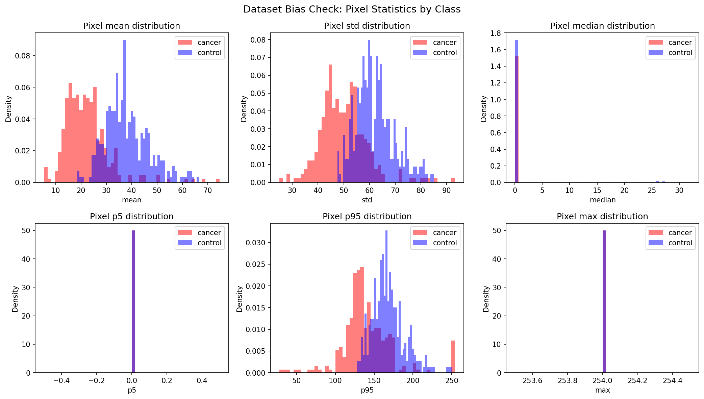
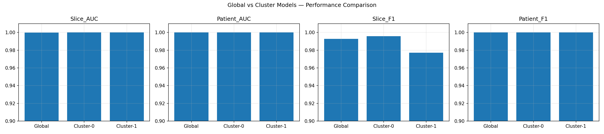

# Multimodal Pancreatic Cancer Detection

[](LICENSE)

Multimodal Pancreatic Cancer Detection is a bias-aware research repository for pancreatic cancer detection using CT imaging and urinary biomarkers. The implemented workflow combines bias-aware CT preprocessing, ResNet50-based CT classification, a seven-feature biomarker MLP, and exploratory multimodal fusion under synthetic pairing constraints.

## What It Does

- detects and mitigates cross-dataset shortcut risk in CT slices before CT model training
- trains a ResNet50 CT classifier with slice-level and patient-level evaluation
- trains a urinary biomarker MLP on the seven-feature panel used in the dissertation
- evaluates decision-level and feature-level fusion with multi-seed repeats and label-mismatch controls
- exports tracked summaries, comparison tables, and curated figures for thesis and research reporting

## Research Flow

1. Prepare CT and biomarker inputs with the preprocessing scripts and notebook setup cells.
2. Run CT bias checks and iterative mitigation.
3. Apply orientation correction, body segmentation, and cropping for CT slices.
4. Train and evaluate the CT ResNet50 model.
5. Train and evaluate the biomarker MLP.
6. Run exploratory fusion experiments with negative controls.
7. Export final summaries, comparison tables, and figures.

## Visual Snapshot

### Bias Mitigation Diagnostic



### Comparative Model Summary



## Result Snapshot

The latest tracked summary in `reports/final_summary.json` reports:

- CT model: ResNet50 (global)
- CT slice-level AUC: 0.9999
- CT patient-level AUC: 1.0000
- Biomarker model: MLP (64-32)
- Biomarker test AUC: 0.9439

Those numbers should be read carefully:

- the biomarker branch is the clearest reproducible positive result in the project
- the CT branch is strong but still scientifically ambiguous because residual domain structure may persist in deep features
- fusion remains exploratory because CT and biomarker cohorts are not patient-paired

## Current Repo State

The repository is in a hybrid but stable research state:

- the latest full experiment flow lives in `notebooks/01_multimodal_cancer_detection.ipynb`
- reusable code is being moved into `src/`
- curated reports and publication-ready figures are tracked in `reports/` and `figures/`
- raw data, processed datasets, checkpoints, embeddings, and thesis assets remain local-only and ignored by Git

If you want the current experiment narrative first, start with:

- `notebooks/01_multimodal_cancer_detection.ipynb`
- `reports/final_summary.json`
- `reports/final_model_comparison.csv`

## Setup

This repo uses `uv` for environment and dependency management.

```powershell
uv sync
```

That command will create or update `.venv` from:

- `pyproject.toml`
- `uv.lock`
- `.python-version`

Typical commands:

```powershell
uv run python -m ipykernel install --user --name multimodal-cancer-detection
uv run python src/data/preprocess/ct_preprocess.py
uv run python src/data/preprocess/biomarker_preprocess.py
uv run pytest
```

## Running The Project

### Main notebook

Open and run:

```text
notebooks/01_multimodal_cancer_detection.ipynb
```

This notebook is currently the main source of truth for the complete multimodal workflow.

### Preprocessing scripts

- `src/data/preprocess/ct_preprocess.py`
- `src/data/preprocess/biomarker_preprocess.py`

The maintained implementation is not a YOLO-plus-ResNet pipeline. The dissertation-aligned workflow in this repo uses bias-aware preprocessing, segmentation/cropping, and ResNet50-based CT classification.

## Testing

The repo includes a lightweight pytest suite for stable helper modules.

Current coverage focuses on:

- project/path utilities
- decision-level fusion helpers
- final summary and report-table helpers

Run:

```powershell
uv run pytest
```

## Project Layout

```text
Multimodal_Cancer_Detection/
|-- configs/
|   `-- paths.yaml
|-- docs/
|-- figures/
|-- notebooks/
|-- reports/
|-- results/
|-- src/
|-- tests/
|-- pyproject.toml
|-- uv.lock
`-- README.md
```

## Documentation

Supporting project documentation lives in:

- `docs/architecture.md`
- `project_strategy.md`
- `ROADMAP.md`
- `DEVLOG.md`
- `docs/timeline.md`
- `docs/figures-guide.md`
- `docs/architectural_decision_records/README.md`
- `docs/architectural_decision_records/ADR-001.md`
- `docs/architectural_decision_records/ADR-002.md`

## Local-Only Assets

The following paths are intentionally ignored and should remain local unless repo policy changes deliberately:

- `data/raw/`
- `data/processed/`
- `models/`
- `embeddings/`
- `thesis/`
- local archive/video files
- temporary staging or Drive-sync folders

## License

See `LICENSE` for the repository license and `docs/` for dataset-specific license notes currently tracked with the project.
