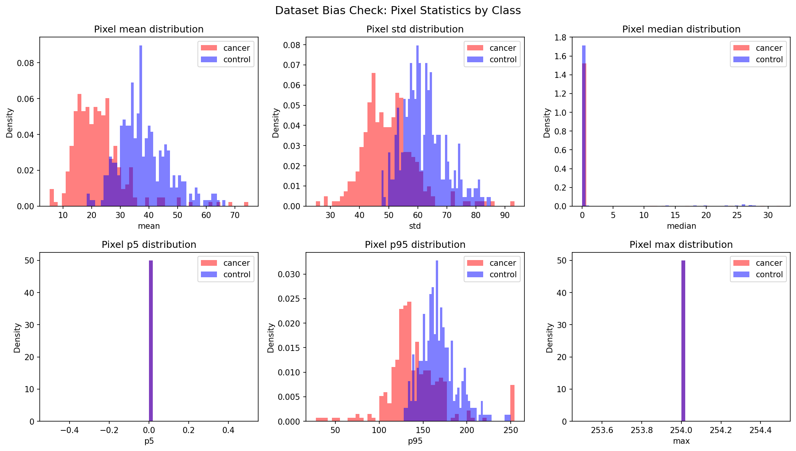
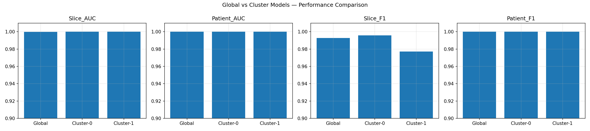

# Multimodal Pancreatic Cancer Detection

Multimodal Pancreatic Cancer Detection is a bias-aware research repository for pancreatic cancer detection using CT imaging and urinary biomarkers. It started as an MSc dissertation (2D ResNet50 CT classifier, seven-feature biomarker MLP, exploratory fusion) and is now being taken to a Q1 paper on shortcut learning: whether a measured scanner confound in the largest public PDAC CT cohort (PANORAMA) is actually exploited by a strong 3D model.

**Documentation index: [`docs/README.md`](docs/README.md)** — every doc, what it answers, and where the data and models live.

## Current Status (2026-10)

The Q1 work uses PANORAMA (2,238 contrast-enhanced CTs; 1,964 Dutch scans for training, 194 MSD + 80 NIH held out as external tests) and 3D nnU-Net models trained on pancreas-region crops.

- **The confound is real in the data:** scanner manufacturer alone predicts PDAC with AUROC 0.70 (Philips scans are 75% PDAC, Siemens/Toshiba ~19%).
- **The model exploits it only weakly:** the in-distribution confound tax of the tight-crop model is +0.031 AUROC (95% CI +0.010 to +0.053), there is no penalty when a whole manufacturer is held out, and the encoder carries little scanner information.
- **It generalises to a new hospital:** on the external MSD cohort the tight model reaches detection AUROC 0.82 [0.76, 0.88] and lesion Dice 0.555, at or above its in-distribution performance.
- **Next:** the deployment-ROI experiment (predicted instead of provided pancreas masks) and a pre-registered mitigation panel — see [`docs/deployment_and_mitigation_design.md`](docs/deployment_and_mitigation_design.md).

Full results: [`docs/modeling_pipeline.md`](docs/modeling_pipeline.md); plan and gaps: [`docs/q1_readiness_and_gaps.md`](docs/q1_readiness_and_gaps.md).

## Thesis-Era Workflow (2025)

The sections below describe the original dissertation pipeline. Its CT headline (AUC 0.9999) is a dataset-of-origin artifact — the motivating case for the Q1 work, not a performance claim.

## What It Does

- detects and mitigates cross-dataset shortcut risk in CT slices before CT model training
- trains a ResNet50 CT classifier with slice-level and patient-level evaluation
- trains a urinary biomarker MLP on the seven-feature panel used in the dissertation
- evaluates decision-level and feature-level fusion with multi-seed repeats and label-mismatch controls
- exports tracked summaries, comparison tables, and curated figures for thesis and research reporting

## Research Flow

1. Prepare CT and biomarker inputs with the preprocessing scripts when fresh local preprocessing is needed.
2. Run CT bias checks and iterative mitigation.
3. Apply orientation correction, body segmentation, and cropping for CT slices.
4. Train and evaluate the CT ResNet50 model.
5. Train and evaluate the biomarker MLP.
6. Run exploratory fusion experiments with negative controls.
7. Export final summaries, comparison tables, and figures.

## Visual Snapshot

### Bias Mitigation Diagnostic

### Comparative Model Summary

## Thesis Result Snapshot

The thesis summary in `reports/final_summary.json` reports:

- CT model: ResNet50 (global)
- CT slice-level AUC: 0.9999
- CT patient-level AUC: 1.0000
- Biomarker model: MLP (64-32)
- Biomarker test AUC: 0.9439

Those numbers should be read carefully:

- the biomarker branch is the clearest reproducible positive result in the project
- the thesis CT result is confounded: cancer and control scans came from different source datasets, so the classifier could separate the datasets rather than the disease
- fusion remains exploratory because CT and biomarker cohorts are not patient-paired

## Documentation

See **[`docs/README.md`](docs/README.md)** for the full index. Most-used:

- [`docs/q1_readiness_and_gaps.md`](docs/q1_readiness_and_gaps.md) — living Q1 plan
- [`docs/modeling_pipeline.md`](docs/modeling_pipeline.md) — 3D nnU-Net pipeline and results
- [`docs/deployment_and_mitigation_design.md`](docs/deployment_and_mitigation_design.md) — pre-registered next experiments
- [`docs/data_layout.md`](docs/data_layout.md) — where data, models and results live
- [`ROADMAP.md`](ROADMAP.md), [`DEVLOG.md`](DEVLOG.md), [`docs/architectural_decision_records/`](docs/architectural_decision_records/README.md)
